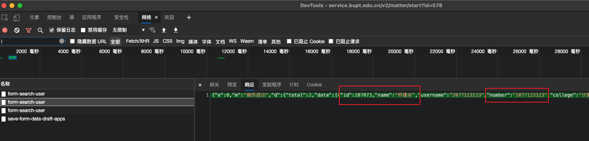

# bupt-access-action

使用 GitHub Actions 自动申请临时出入校园申请。

这个 Action 会自动在北京时间的每天 8:00 AM 进行。

## 使用方法

首先，点击上方绿色的 **Use this template**，使用这个模板创建你自己的 Repository；

然后，在你自己仓库的 Settings 的 Secrets 中设置以下信息：

- `USERNAME`: 你用来登录的学号；
- `PASSWORD`: 你用来登录的密码。
- `PHONE`: 你用来登记的电话号码。
- `TEACHER_UID`: 你的辅导员ID。
- `TEACHER_NAME`: 你的辅导员姓名。
- `TEACHER_NUMBER`: 你的辅导员工号。
- `DESTINATION`: 出校目的地(可选)，默认为`柏油`。
- `REASON`: 出校原因(可选)，默认为`打工`。

**尽管存在API查询辅导员信息，但由于辅导员存在重名可能，所以这里通过手动获取辅导员信息来避免错误，你可以在申请页面开发者工具中查看辅导员的相关信息**


## 其他

你可以在 `.github/workflows/main.yml` 中来设置每天运行的时间：

```yml
on:
  schedule:
    - cron: '0 0 * * *'
```

格式是标准的 cron 格式，第一个数字代表分钟，第二个数字代表小时。例如，`0 1 * * *` 表示在每天
格林尼治时间的 1:00 AM，也就是在北京时间的 9:00 AM 自动运行。